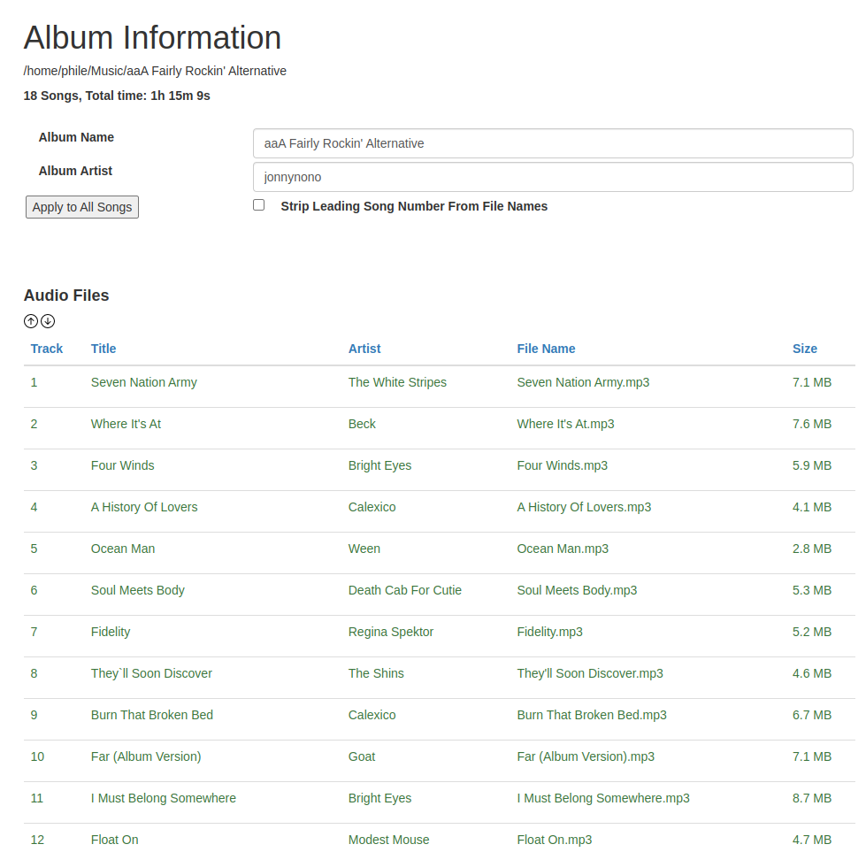
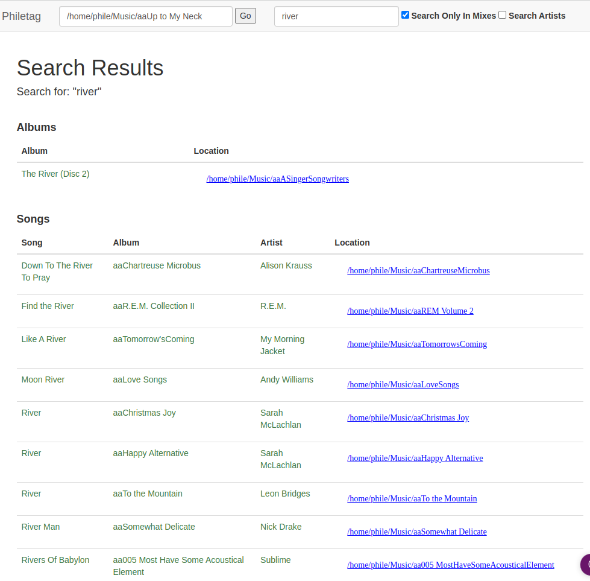
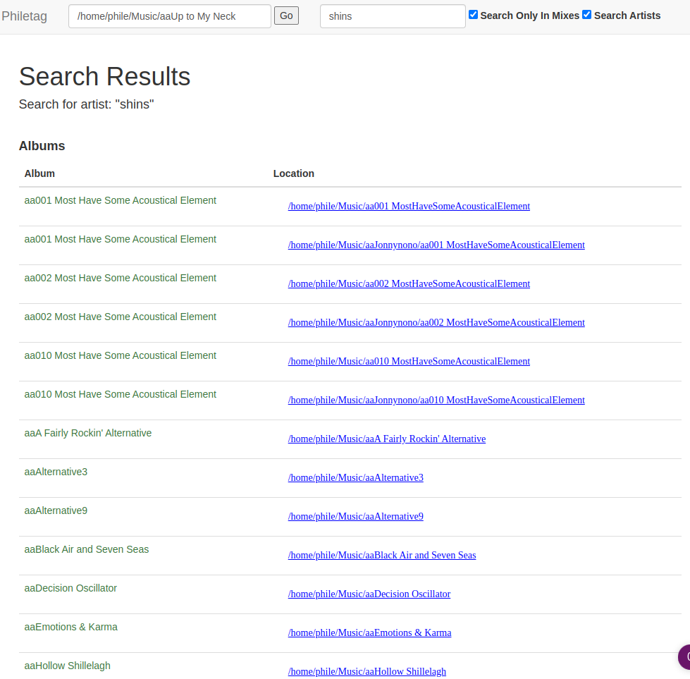
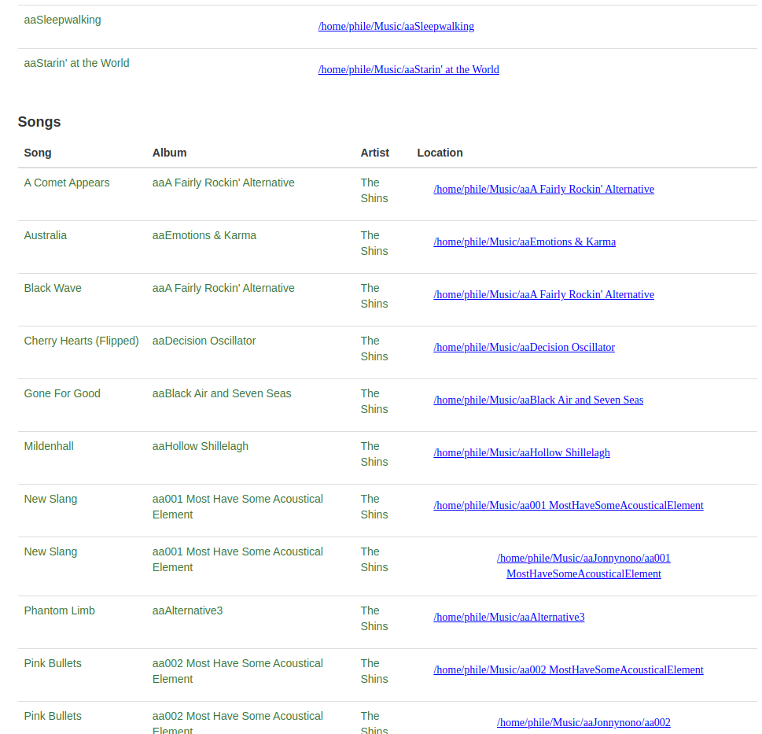

# phile-tag
A Python Flask project to examine and change metadata for local music (MP3 and FLAC) files. 

The best way to run phile-tag is with Docker. See the *Build Docker* and *Run the Docker* sections below.

## Screens

### Album Information



### Search Results








## Installation Instructions

**Set up the Conda environment**

Make sure Conda is up to date:
```
conda update -n base -c defaults conda
```

Create a new Conda environment:
```
conda create -n phileTag
```

Activate Conda:
```
conda activate phileTag
```

**Install modules**
```
    conda install -c conda-forge mutagen
    conda install flask
    conda install -c conda-forge flask-bootstrap
    conda install flask-wtf
    conda install -c conda-forge python-dotenv
```

**Build Docker**
```
docker build . -t phile-tag
```

**Run the Docker**
```
./start-docker
```

**Stop the Docker**
```
docker stop phile-tag
```

**How to use phile-tag**

Once the docker is running, open a web browser and navigate to http://localhost:5001

Notes on Docker execution:
* The start-docker shell script uses the 5001 port on the local machine. You can change that port to anything you want in the shell script.
* The shell script attaches a Docker volume to the folder "${HOME}/Music" on the local machine. Change that value to wherever the root of your music folder is.
* Phile-tag allows you to view and alter MP3 and FLAC files on your local machine. You can set the tag information or the file name. Keep that in mind when you are using it, the changes you make are actually applied to your files in real time, so only make changes you actually want to make.

